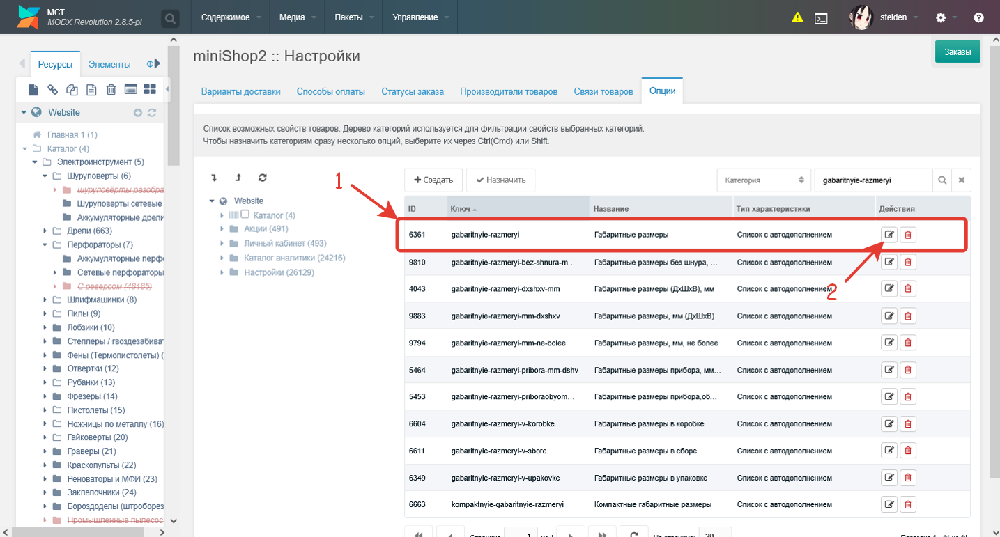
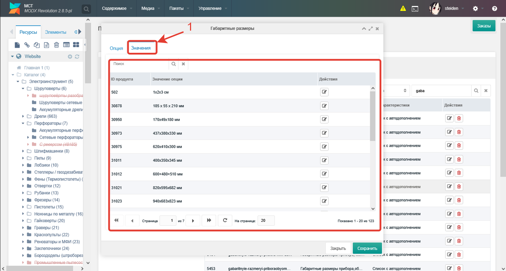
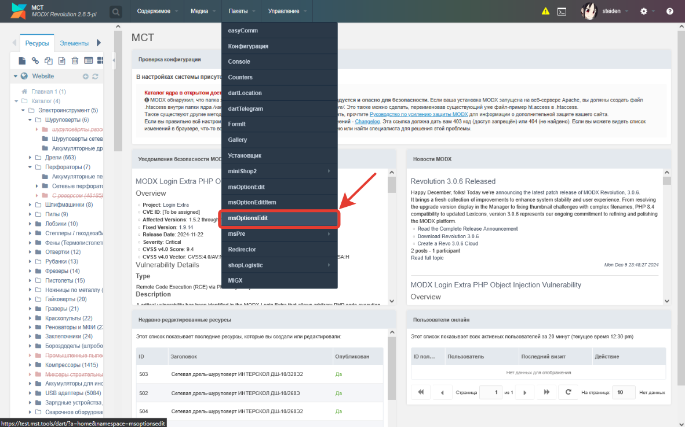
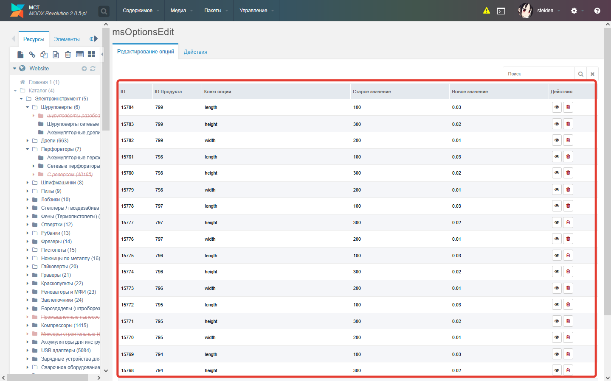
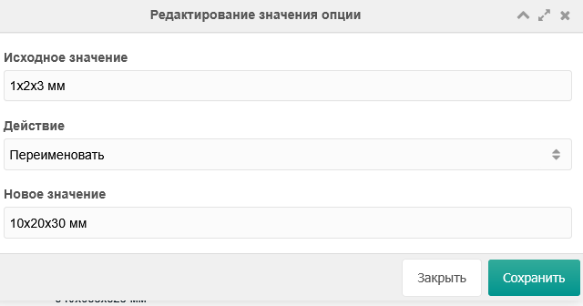
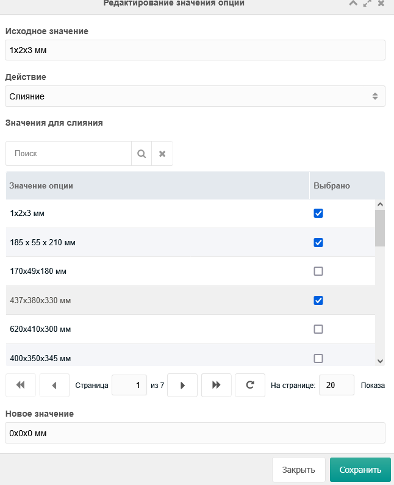
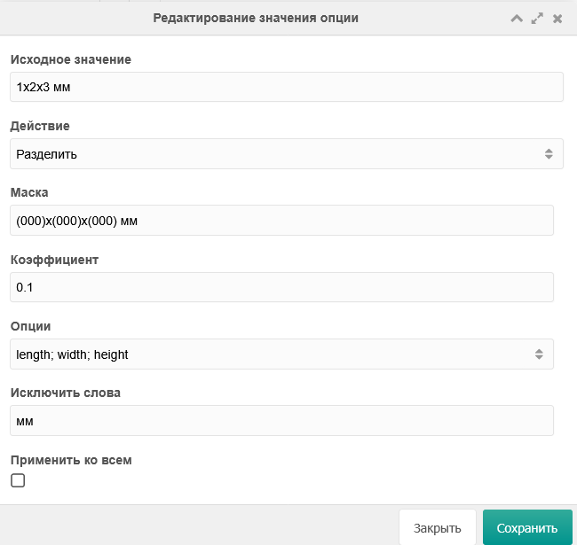
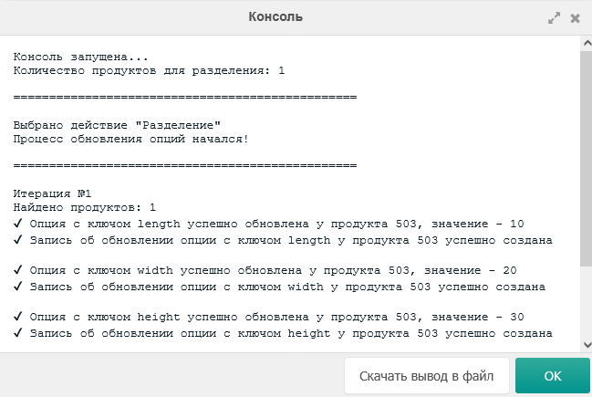

Оглавление

[Введение](#введение)

[Переименование](#переименование)

[Слияние](#слияние)

[Разделение](#разделение)

[История изменений](#история-изменений)

# Введение

Компонент msOptionsEdit представляет из себя пакет msOptionsEdit и дополнение к пакету miniShop2. На данный момент он работает с обработкой значений опций, указанных в товарах. Сейчас доступен следующий функционал: переименование, слияние, разделение, история изменений.

Обработка значений опций (переименование, слияние, разделение) происходит в дополнении пакета miniShop2:

История изменений значений опций находится в пакете msOptionsEdit:

В msOptionsEdit две вкладки: редактирование опций и действия. На первой вкладке представлена история изменения всех значений у опций продуктов. На второй вкладке расположен список действий для обработки значений (переименование, слияние, разделение).

При начале обработки значений опции открывается консоль, отображающая порядок обработки. По окончанию, кнопка «ОК» становится активной и консоль можно закрыть. После её закрытия список значений опции автоматически обновляется.

# Переименование

Функция «Переименование» изменяет значение выбранной опции у всех продуктов на введенное значение пользователем. На вход принимается:

1.  исходное значение (установлено по умолчанию),
2.  действие (выбрать «Переименовать»),
3.  новое значение.

Пример использования. Например, есть опция «Длина, см». У некоторых продуктов значение этой опции такое – «10 мм». Опция предназначена для сантиметров в качестве единицы измерения, но у этого значения ошибочно указана единица измерения «мм» (миллиметры). Чтобы исправить это, необходимо:

*выбрать опцию «Длина, см» ⟶ перейти на вкладку «Значения» ⟶ найти значение «10 мм» ⟶ открыть его окно редактирования ⟶ выбрать действие «Переименовать» ⟶ ввести новое значение (в случае примера, «10 см») ⟶ нажать кнопку «Сохранить»*

После этого, у всех продуктов, которые имели такое значение опции, оно было изменено на новое (введенное пользователем).

Окно редактирования с выбранным действием «Переименовать» выглядит следующим образом:

Демонстрационное видео примера использования:

# Слияние

Функция «Слияние» схожа с функцией «Переименование». Здесь так же можно переименовать значение, но выбрать уже несколько значений. Способ и примеры применения этого действия такие же. На вход принимаются:

1.  исходное значение (указано по умолчанию),
2.  действие (выбрать «Слияние»),
3.  значения для слияния (выбрать из таблицы),
4.  новое значение.

Для выбора значения для слияния из таблицы, необходимо перевести флажок в активное состояние.

Окно редактирования значения опции выглядит следующим образом:

Демонстрационное видео примера использования:

# Разделение

Функция «Разделение» разделяет одно значение опции на несколько значения для разных опций. Обработка, по умолчанию, происходит для одного продукта. Для обработки всех, необходимо установить флажок «Применить ко всем» в активное положение. На вход функция принимает:

1.  исходное значение (установлено по умолчанию),
2.  действие (выбрать «Разделить»),
3.  маска (её работа описана ниже),
4.  коэффициент (числовое значение, на которое необходимо умножить все полученные значения),
5.  опции (список опций, которым необходимо установить соответствующее им значение),
6.  список слов на исключение (поле «Исключить слова»),
7.  применить ко всем (флажок).

Маска работает так: в ней указывается, в каком месте исходного значения должны быть значения, которые надо получить. Пример: есть исходное значение «1х2х3 мм», необходимо получить значения 1, 2 и 3. Для этого, вводим маску такого вида – «(000)х(000)х(000) мм». Обозначение **«(000)»** заменяет нужное нам значение.

Коэффициент является полем для ввода числового значения. Он указывается для тех случаев, когда необходимо перевести полученные **числовые** значения в другую единицу измерения. Например, есть исходное значение «1х2х3 см», но мы хотим, чтобы полученные после разделения значения были в мм (миллиметрах). Для этого указываем коэффициент 10 и все значения будут умножены на это число. **По умолчанию** следует указывать 1.

Список опций необходим для заполнения. Здесь указываются те опции, в которые будут установлены полученные значения. Необходимо перечислять названия опций через точку с запятой. В процессе ввода в поле, откроется выпадающий список с предложенными опциями. Поиск ведется по последнему слову после точки с запятой. После точки с запятой можно как ставить пробел (или несколько), так и не ставить. Опции необходимо перечислять в том же порядке (и в том же количестве), в каком будут разделены значения. Например, есть исходное значение «1х2х3 см», для которого установлена маска «(000)х(000)х(000) см». После разделения, значения будут в следующем порядке: 1, 2, 3. Нам нужно установить в качестве ширины – 1, в качестве длины – 2, и в качестве высоты – 3. Для этого, записываем в поле «Опции» - «Ширина; Длина; Высота».

Поле для исключения слов является обычным текстовым полем. Здесь через запятую (с пробелами или нет после неё) вводятся слова, которые нужно убрать из полученных после разделения значений. Вводить также можно фразы (не использующие запятые) и символы.

Флажок «Применить ко всем» позволяет обрабатывать все значения продуктов, которые подходят маске. Например, для маски «(000)х(000)х(000)» под обработку попадут значения типа «1х2х3 см», «Габаритные размеры: 10х20х30 мм», «АхБхВ» и т.д.

Окно редактирования значения опции с выбранным действием «Разделить» выглядит следующим образом»:

Консоль функции разделения содержит больше данных: информацию об установленных ключах и их значениях, а также идентификатор продукта (id); информацию об успешности выполнения операций сохранения изменения, сохранения изменения в историю изменений, и удаления старого значения разделенной опции.

Демонстрационное видео примера использования (с одним значением):

Демонстрационное видео примера использования (с несколькими значениями):

# 

# История изменений

Все изменения обработанных значений сохраняются. Если конкретнее, сохраняются: идентификатор продукта (id), ключ измененной опции, старое значение, новое значение.

Здесь есть возможность посмотреть подробную информацию, где дополнительно показываются дата и время создания изменения, и удалить это изменение. После удаления изменения, значению опции продукта установится его старое значение. Также можно удалить несколько строк сразу: выбрать необходимый диапазон, нажать в его области ПКМ (правой кнопкой мыши) и выбрать удаление изменений опций.
